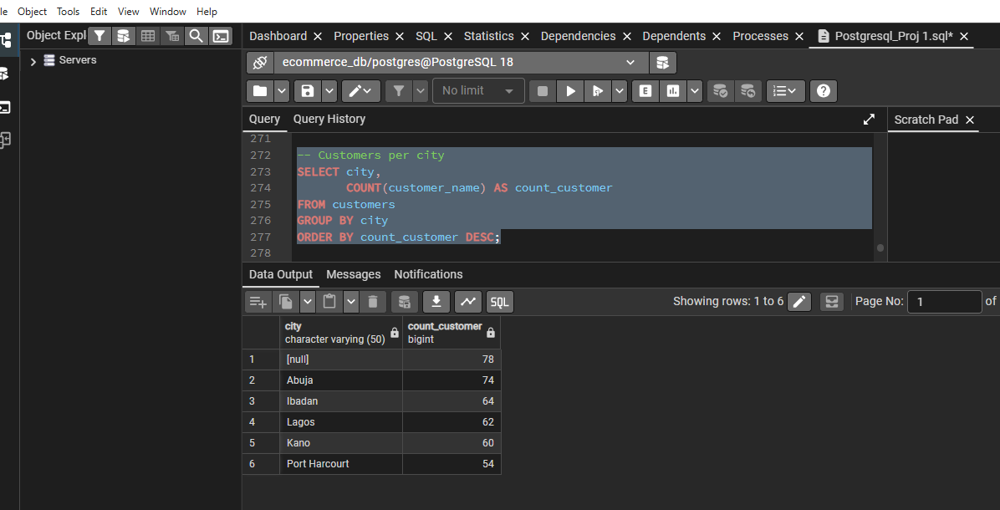
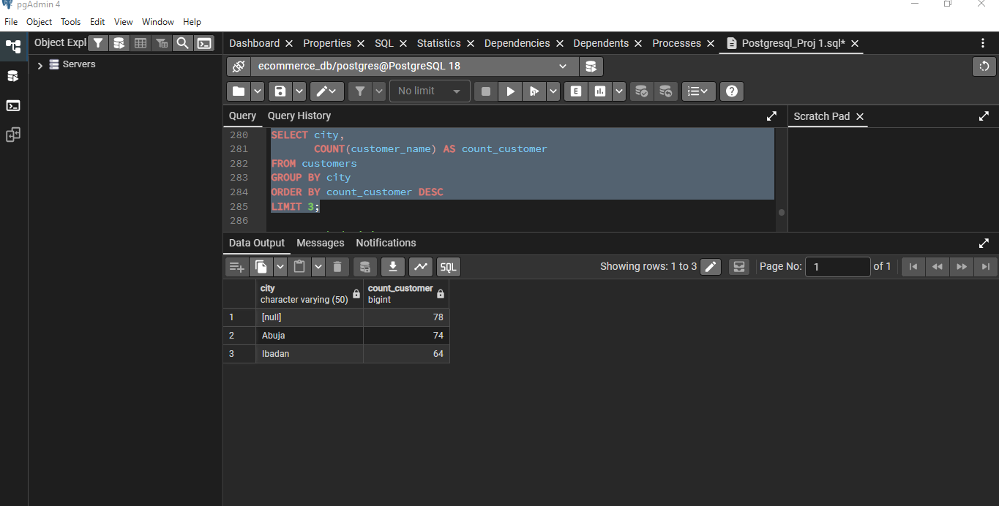
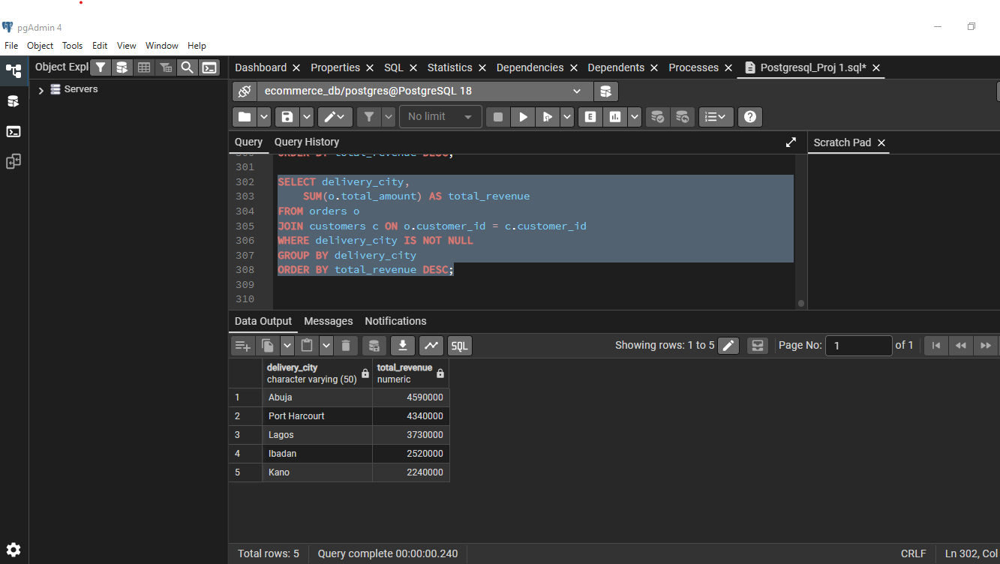
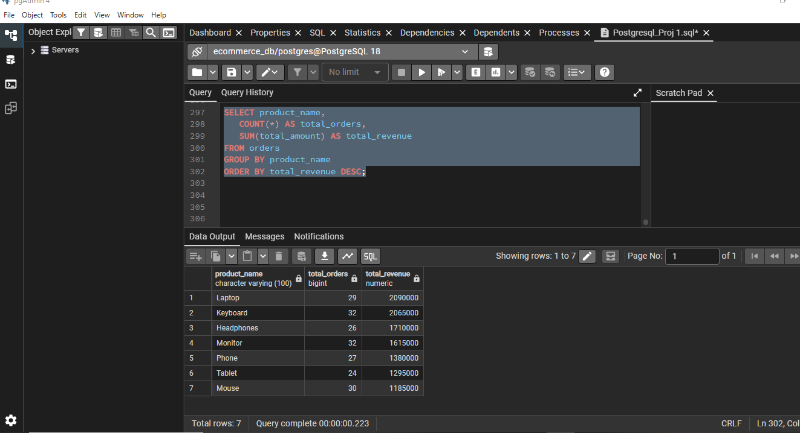
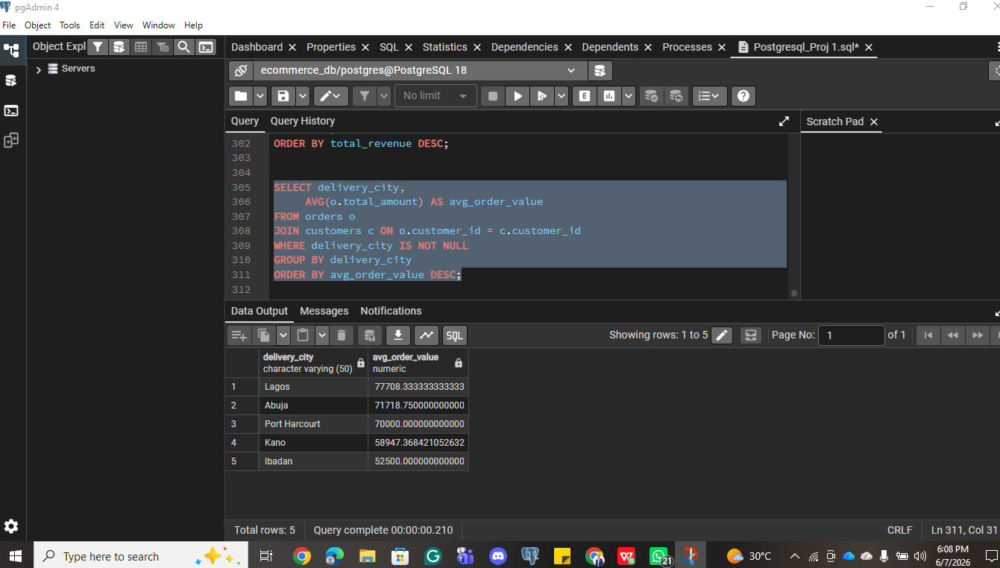
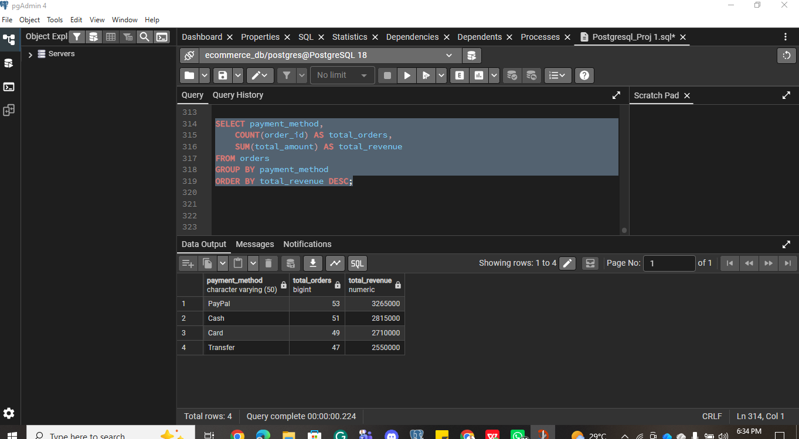
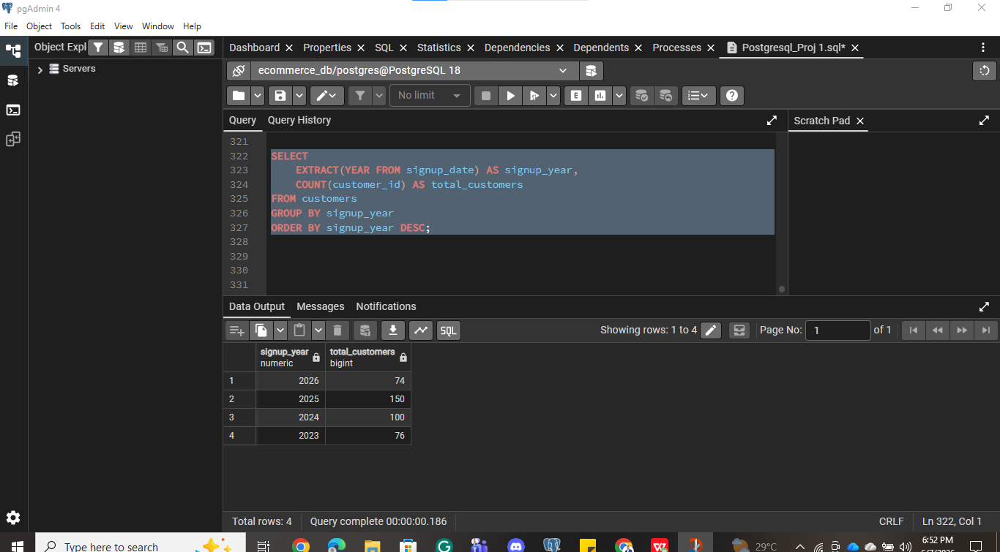

# E-Commerce Exploratory Data Analysis (SQL)

Exploratory data analysis on e-commerce customer and order data using SQL in PostgreSQL (pgAdmin 4) — analyzing sales performance, customer behavior, and product trends to support business decisions, framed as a Junior Data Analyst assignment.

## Project Overview

Management wanted to understand sales performance, customer behavior, and product trends from the customers and orders datasets. This project uses `GROUP BY`, `JOIN`s, aggregate functions (`COUNT`, `SUM`, `AVG`), `ORDER BY`, and `LIMIT` to explore customer distribution by city, revenue generation, product performance, payment method trends, and customer sign-up patterns — then turns the findings into business recommendations.

**Tools used:** PostgreSQL, pgAdmin 4

## The Data

- **Customers dataset:** `data/ecommerce_customers.csv` — customer records (customer_id, customer_name, email, phone_number, city, gender, signup_date)
- **Orders dataset:** `data/ecommerce_orders.csv` — order records (order_id, customer_id, product_name, quantity, price, total_amount, payment_method, order_date, delivery_city)

## Queries & Findings

All queries are in [`ecommerce_eda_queries.sql`](ecommerce_eda_queries.sql).

### 1. Customer distribution by city
```sql
SELECT city,
        COUNT(customer_name) AS count_customer
FROM customers
GROUP BY city
ORDER BY count_customer DESC;
```


Top 3 cities by customer count:
```sql
SELECT city,
        COUNT(*) AS count_customer
FROM customers
GROUP BY city
ORDER BY count_customer DESC
LIMIT 3;
```


**Finding:** Abuja, Ibadan, and Kano are the top 3 cities by customer count.

### 2. Revenue by city
```sql
SELECT delivery_city,
    SUM(o.total_amount) AS total_revenue
FROM orders o
JOIN customers c ON o.customer_id = c.customer_id
WHERE delivery_city IS NOT NULL
GROUP BY delivery_city
ORDER BY total_revenue DESC;
```


**Finding:** The top customer cities also rank among the top revenue-generating cities, confirming a strong overlap between customer volume and revenue contribution.

### 3. Revenue and orders by product
```sql
SELECT product_name,
        COUNT(order_id) AS total_orders,
        SUM(total_amount) AS total_revenue
FROM orders
GROUP BY product_name
ORDER BY total_revenue DESC;
```


**Finding:** The **Laptop** is the best-performing product, generating ₦2,090,000 in total revenue — the highest of any single product.

### 4. Average order value by city
```sql
SELECT delivery_city,
        AVG(o.total_amount) AS avg_order_value
FROM orders o
JOIN customers c ON o.customer_id = c.customer_id
WHERE c.delivery_city IS NOT NULL
GROUP BY c.delivery_city
ORDER BY avg_order_value DESC;
```


**Finding:** Average order value varies by city, highlighting cities where customers tend to spend more per transaction, not just more often.

### 5. Revenue and orders by payment method
```sql
SELECT payment_method,
        COUNT(order_id) AS total_orders,
        SUM(total_amount) AS total_revenue
FROM orders
GROUP BY payment_method
ORDER BY total_revenue DESC;
```


**Finding:** **PayPal** contributes the most revenue overall, at ₦3,265,000.

### 6. Customer sign-ups by year
```sql
SELECT
    EXTRACT(YEAR FROM signup_date) AS signup_year,
        COUNT(customer_id) AS total_customers
FROM customers
GROUP BY signup_year
ORDER BY signup_year DESC;
```


**Finding:** Sign-up volume by year shows how the customer base has grown over time, useful for tracking acquisition trends.

## Business Recommendations

1. **Focus marketing on top-performing cities.** Abuja, Ibadan, and Kano have both the highest customer counts and the strongest revenue contribution. Concentrating targeted marketing and engagement campaigns in these cities would strengthen the company's already-strongest markets.

2. **Promote and bundle the top-performing product (Laptop).** With ₦2,090,000 in revenue, laptops are the clear top performer. Bundling laptops with accessories and promoting them more aggressively could increase both visibility and overall profitability.

3. **Optimize and incentivize PayPal payments.** PayPal already generates the most revenue (₦3,265,000). Improving the PayPal checkout experience and offering a small incentive (e.g. 2% cashback) could shift more customers away from Cash/Transfer — which carry higher logistical risk and failed-delivery rates — toward PayPal.

## Skills Demonstrated

- SQL aggregate functions: `COUNT`, `SUM`, `AVG`
- `GROUP BY` for segmenting data across multiple dimensions (city, product, payment method, year)
- `JOIN`s to combine customer and order data
- `ORDER BY` and `LIMIT` for ranking and top-N analysis
- Extracting date parts with `EXTRACT(YEAR FROM ...)`
- Translating raw query output into business recommendations
- Working in PostgreSQL via pgAdmin 4
